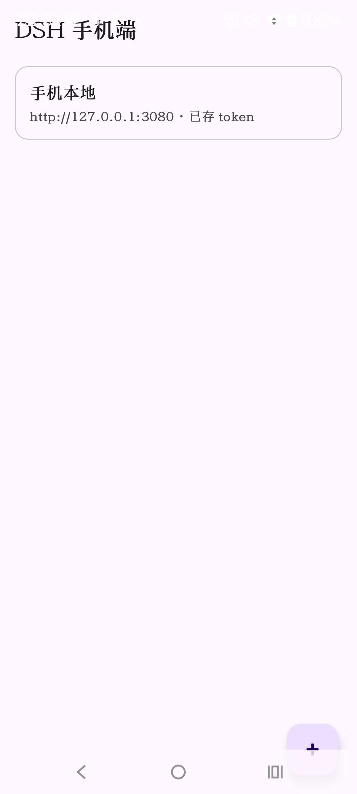
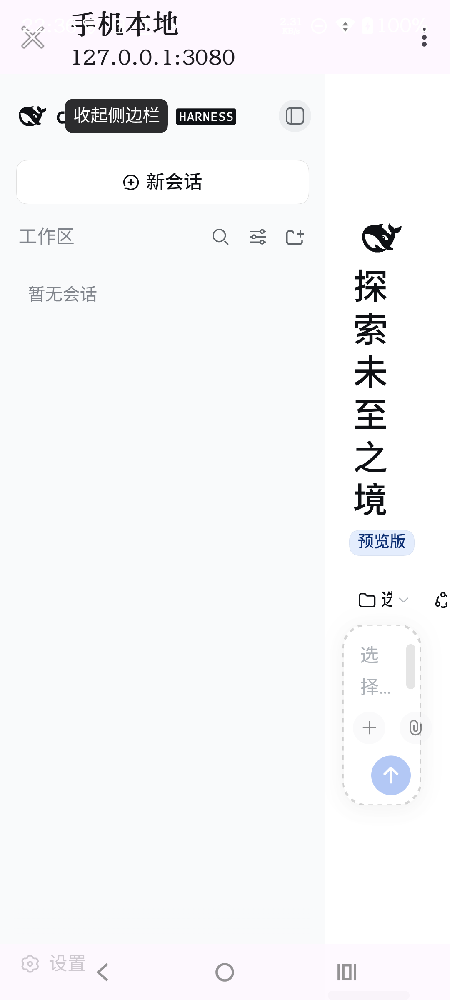
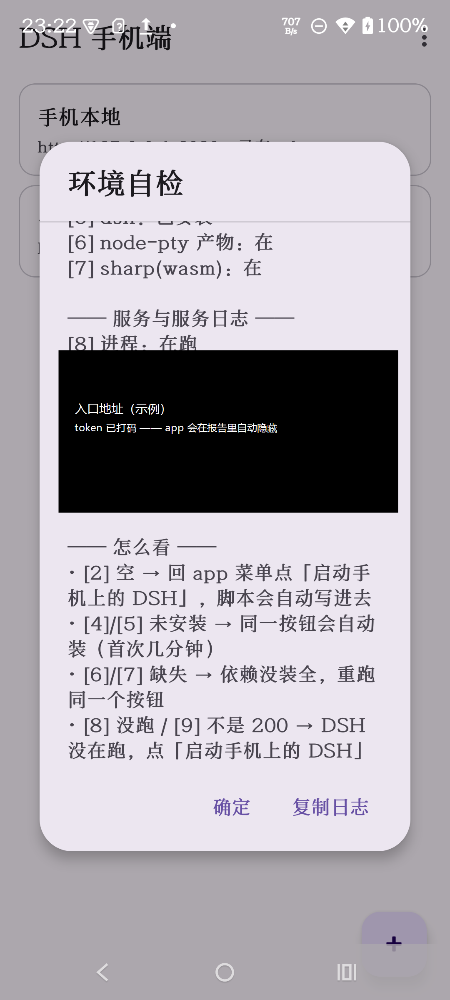

# DSH 手机端 · dsh-mobile

> 把 [DeepSeek Harness](https://www.npmjs.com/package/@deepseek-ai/dsh)（DSH）装进 Android 手机的**专用 WebView 壳**。
> 不是第二个 DSH 实现：引擎（会话、技能、工具、本地模型）继续跑在它该跑的地方，本项目只解决"在手机上用得顺手"。

<p>
  
</p>

**Android 13+（minSdk 33 / targetSdk 35；真机实测于 Moto G54 / Android 15）· Kotlin + 传统 View · 无网络依赖（除你自己指定的 DSH 实例）· 无遥测 · MIT**

## 先说不足（作者自陈）· 欢迎你指出问题

**这是一个人的业余项目，也是作者第一次把东西开源出来**：没有团队、没有代码评审、没有 CI（暂时）。
你翻代码时如果觉得"这段像是新手写的"——那很可能确实是，**请直接说，不必客气**。
把不足写在最前面，是因为这个仓库的价值一半在代码、一半在**踩过的坑**；坑被指出来，才是它公开的意义。

### 已知不足（按"最可能被专业人士挑"排序，都是事实）

| # | 不足 | 到什么程度 |
|---|---|---|
| 1 | **只在这两台真机上验证过** | moto g54（Android 13 / 15）、moto XT2611-1（Android 16）。**没有模拟器、没有 Robolectric、没有仪器测试** —— 界面回归目前靠人眼 |
| 2 | **实际上只有 arm64 能跑** | APK 本身不含原生库（不限架构），卡在 Termux 侧：附带的是 `arm64-v8a` 版 Termux，且 `termux/fix-android-runtime.sh` 里写死了 `node-addon-system-android-arm64`。x86_64（模拟器 / Intel 平板）今天跑不起来 |
| 3 | **不符合现代 Android 写法** | 传统 View + XML（不是 Compose）；没有 ViewModel / Flow 分层；`MainActivity.startLocalDsh()` 里还直接 `Thread{}.start()` |
| 4 | **依赖 Termux 的私有行为** | `RUN_COMMAND` 服务 + `allow-external-apps`、往用户 `~/.bashrc` 塞钩子、`termux-clipboard-*`。**Termux 没有承诺这些接口稳定**，它一升级就可能坏 |
| 5 | **为了让它跑起来动了 DSH 的运行时** | patch 平台闸门、`fs.link`→`rename`、自己编 flock/landlock 原生模块、安装配方钉死上游 `0.1.5-rc.2`（rc.3 的发布树是坏的）。**这些都是技术债**，上游一变就得重做 |
| 6 | **两处安全是"权衡之后仍然有代价"的** | `usesCleartextTraffic="true"`（DSH 只跑 loopback HTTP，被迫）；模式 B 的 B2 代理**有意绕过** DSH 的 browser-trust 栅栏。代价都写在 `SECURITY.md`，**但作者不是安全专家，非常希望被专业地反驳** |
| 7 | **工程完备性缺口** | 没有 CI、没有 gradle wrapper、没有正式签名流程、没有 issue 模板、没有 `.editorconfig`、English UI 没做；文档中文优先、篇幅偏长（原本是写给作者自己的手册） |

### 作者不辩解的三条

1. **写错了就是写错了。** 被指出后我只做两件事：改掉它，或者把"为什么不得不这样"写进文档。
2. **不会为了好看而隐藏已知问题。** 仓库里每处"不优雅"的地方，基本都能在 `CHANGELOG.md` 或 `docs/` 里找到当时为什么这么做。
3. **指出问题的人会被记名致谢**（写进 `CHANGELOG.md`，除非你说不要）—— 你的十分钟，能让下一个踩坑的人少走一遍。

### 最想听的五类意见（按渴望程度排序）

1. **安全**：凭据流转、明文 HTTP、权限模型、WebView 配置（第三方 cookie、文件上传/下载、JS 桥）。
2. **Android 平台正确性**：前台服务、后台启动限制、运行时权限、生命周期、分区存储、电量策略。
3. **Termux 集成的正确姿势**：有没有比 `RUN_COMMAND` + `.bashrc` 钩子更稳、更"官方"的做法。
4. **Kotlin 结构与命名**：`core/`（纯逻辑）+ `platform/`（适配）这条分法是否成立。
5. **构建与测试**：契约检查 / 桩测试的思路对不对，以及怎么用最低成本加上真机之外的回归。

**提意见不用写长文**：一句话就够，例如「`DshWebView.kt` 的 cookie 处理不对，应该用 CookieManager 的 X」。

> **English (short).** This is a **hobby project by one person**, open-sourced for the first time — no team, no code
> review, no CI yet. If something looks amateurish, it probably is: please say so plainly. Known gaps are in the table
> above (2 devices tested, arm64 only, non-idiomatic Android, reliance on private Termux behaviours, runtime patches to
> DSH, two security trade-offs, no CI/wrapper/release signing). **Security reviews and platform-correctness critiques are
> the most welcome**, and reviewers are credited in `CHANGELOG.md`.

## 真机截图

| 入口列表 | WebView 里的 DSH 界面 | 环境自检 |
|---|---|---|
|  |  |  |

三张都是 **moto g54（Android 15）** 上的实拍：左边是模式 A 跑通后 app 自动收到的「手机本地」入口
（Termux 脚本回传的，含 token）；中间是同一条链路的终点 —— 真正的 DSH Web 界面在 app 的 WebView 里渲染；
右边是在 Termux 处于后台的情况下拿到的自检报告（走剪贴板通道，见下文）。

---

## English overview

`dsh-mobile` is an Android **client shell** for DeepSeek Harness (DSH). DSH itself is a Node CLI/Web GUI that only ever
binds `127.0.0.1`; this app gives you a proper mobile front end for it in two modes:

- **Local** — run DSH inside Termux on the phone (loopback only, matching DSH's own trust model) and let the app pick up
  the tokenized URL automatically.
- **Remote** — reach a DSH instance running on your PC through an SSH tunnel (recommended, encrypted) or a
  loopback-rewriting proxy (no admin needed, plaintext — read `SECURITY.md` before using it).

It is an unofficial client: it bundles **no DSH code**, and no DeepSeek trademarks are used (the whale icon is original).
Build with `tools/build-apk.ps1`; see `docs/` for the full manuals.

---

## 这个是什么 / 不是什么

| 是 | 不是 |
|---|---|
| DSH Web GUI 的 Android 外壳：多入口管理、token 自动交换、cookie 持久化、文件上传/下载、崩溃日志落盘 | 不是 DSH 的重写，也不包含它的任何代码 |
| 两种部署模式（手机本地 / 连 PC）的**说明书 + 脚本 + 客户端** | **不能**让手机直连 PC 的 3080 端口（原因见下） |
| 一套可复现的构建链（工具链脚本 + 契约检查 + 桩测试 + 图标自检） | 不是通用浏览器、不是 Android 版 DSH 服务端 |

### 为什么是这个形态（三条硬约束，都实测过）

1. **DSH 永远只监听 `127.0.0.1`。**
   `dsh web --host 0.0.0.0` 会被服务端直接拒绝，原话是：
   *`--host 0.0.0.0 is intentionally not supported yet for safety: it would expose remote code execution to the network`*；
   `--host 192.168.0.105` 则配置校验失败（`$.host expected "127.0.0.1" | "0.0.0.0"`）。
   → **手机不可能直连 PC 的端口**，模式 B 必须先有转发者。
2. **认证是"根 URL 带 `?token=` 换签名 cookie"。**
   token 只在 `GET /` 上被接受，换到的 cookie 绑 `hostname+port`、`HttpOnly`、`SameSite=Strict`、
   **故意不带 `Secure`**（因为官方只跑 loopback HTTP）。→ 壳子要做的第一件事就是把 token 交换掉，然后停在干净 `/`；
   也决定了模式 B 的代理**必须**把 `Host`/`Origin` 改写成 loopback 才能过信任栅栏。
3. **服务端全是 Cordis 插件，客户端是 Typert RPC + `/api` Fetch 桥 + 事件流 + WebSocket `/api/remote.mux`。**
   → 在 Kotlin 里重实现整套协议是另一个工程；本项目直接复用官方 Web UI，只做壳。

---

## 功能

| 能力 | 说明 |
|---|---|
| 多入口 | 手机本地 / 家里 PC / 别的机器，各存一条；点一下就进 |
| **一键装/启（模式 A）** | 手机侧脚本**打进 APK 的 assets**，由 app 用 Termux 的 RUN_COMMAND **现场写进 Termux 再执行**：不需要 MTP 拷文件、不需要手动敲命令。幂等，可反复点 |
| **环境自检** | 菜单里一项，把这条链路每一环都查一遍（脚本在不在 / allow-external-apps / node / dsh / node-pty 产物 / wasm sharp / 进程 / 端口探活 / 入口地址），结果回传到 app 里显示并可复制 |
| 粘贴即识别 | 直接把 DSH 打印的**整行**粘进来即可：`dsh web: http://127.0.0.1:3080/?token=… (LAN: …)` —— 自动摘出地址与 token |
| **剪贴板通道** | Termux 在后台时，Android 会拦它启动本 app 的页面（`Background activity launch blocked`）→ 所以入口地址与自检报告都**同时写进剪贴板**，app 在前台自动收下（认不出的内容一律忽略） |
| 自动命名 | 本机入口叫「手机本地」，远程叫「远程 <主机>」——早期版本不管哪来的都叫「手机本地」，两条入口同名分不清（真机发现） |
| token 自动交换 | 首次加载用带 token 的根 URL，之后靠 cookie；遇到 401/403 会**先自动重试一次**，仍失败才提示 |
| cookie 持久化 | 复用系统 WebView 的 cookie 存储，30 天内不用重新认证 |
| 外链与安全 | DSH 之外的所有链接**一律交给系统浏览器**，壳子不当浏览器用 |
| 文件上传 | WebView 的 `onShowFileChooser` → 系统文件选择器（SAF） |
| 文件下载 | 走系统 `DownloadManager`，**并把 cookie 带上**（DSH 的文件下载需要认证） |
| 崩溃可查 | 全局未捕获异常落盘，下次打开弹窗显示，带**一键复制**（不必连电脑抓 logcat） |
| 手动重认证 | 菜单里「重新认证（清 cookie 再交换 token）」 |
| Termux 联动 | 「启动手机上的 DSH」通过 Termux `RUN_COMMAND` 触发；脚本跑完把入口地址**回传**给 app；首次会当场申请 Termux 的执行权限 |

**刻意不做**（避免功能膨胀）：不含终端模拟器、不内置 DSH、不代管 API key、不做后台常驻服务、不收集任何数据。

---

## 两种模式

```
模式 A · 手机自己跑（合规路径：一切都在 loopback 内）
┌─────────────────────────── Android 手机 ───────────────────────────┐
│  Termux                          DSH 手机端 (app.dsh.mobile)        │
│  ├─ node + `dsh web --port 3080`  ┌──────────────────────────────┐  │
│  │      ↑ 只绑 127.0.0.1          │ MainActivity   入口列表       │  │
│  └─ start-dsh.sh ──打印 token URL─▶│ WebActivity    WebView        │  │
│         │ am start -e dsh_url      │ DshWebView     cookie/上传/下载│  │
│         └─────────────────────────▶└──────────────────────────────┘  │
└────────────────────────────────────────────────────────────────────┘
     代价：手机上没有 ComfyUI / 本地大模型；模型走云端 API key

模式 B · 连 PC（DSH 只监听 127.0.0.1，必须先转发）
┌── PC ──────────────────────┐        ┌──── Android 手机 ────┐
│ dsh web  →  127.0.0.1:3080 │        │  DSH 手机端 (app)     │
└────────────┬───────────────┘        │  WebView ──┐         │
             │                        └────────────┼─────────┘
   B1 SSH 隧道（推荐：加密、不绕栅栏）              │
      ssh -L 3080:127.0.0.1:3080 ─────────────────┘  手机上的
      （Termux 里跑 termux/tunnel-to-pc.sh）           127.0.0.1:3080
                                                      = PC 的回环口
   B2 免管理员代理（明文 + 绕过栅栏，只在家里 Wi-Fi 用）
      node tools/loopback-proxy.mjs --listen 0.0.0.0:8081 --target 127.0.0.1:3080
      → 手机访问 http://<PC-IP>:8081/?token=…
```

详细步骤：**[docs/01-termux-local.md](docs/01-termux-local.md)**（模式 A）· **[docs/02-remote-pc.md](docs/02-remote-pc.md)**（模式 B）· **[docs/03-build.md](docs/03-build.md)**（构建/安装/排障）。

---

## 快速开始

### 用户：装 APK

1. 下载 `dsh-mobile-<版本>-debug.apk`（Releases 页，或自己构建）。
2. 手机允许「安装未知应用」，装上。
3. 打开 app → `+` → 粘贴 DSH 的入口地址（带 token 的那整行）→ 保存 → 点卡片进 WebView。
4. 想用模式 A：装 **Termux** + **Termux:API**（F-Droid），把 `termux/*.sh` 放到 `~/dsh-android/`，跑 `bash ~/dsh-android/setup-dsh.sh`。

> ⚠ 调试签名：本项目用**自己生成的**调试密钥（`tools/make-debug-keystore.ps1`，生效时间从 2020 年起、30 年有效）。
> 不同机器生成的密钥不同 → **换机器/换签名来源的 APK 需要先卸载再装**。

### 开发者：从源码构建（Windows）

```powershell
git clone <this repo> ; cd dsh-mobile

# 1) 拉工具链（全部走国内镜像；约 578 MB）
powershell -File tools\fetch-toolchain.ps1
# 2) 展开并逐项验证（java / aapt2 / adb / gradle / sdkmanager）
powershell -File tools\install-toolchain.ps1

# 3) 出包（会先跑契约检查 + Termux 脚本测试，再 assembleDebug，最后打印 APK 哈希与签名指纹）
powershell -File tools\build-apk.ps1
#    只跑单测：
powershell -File tools\build-apk.ps1 -Task testDebugUnitTest
```

**工具链位置可移植**：默认 `E:\Android`，换机器设一个环境变量即可，无需改脚本：

```powershell
$env:DSH_ANDROID_TOOLCHAIN = 'D:\Android'
```

| 事实 | 唯一来源 |
|---|---|
| 工具链目录（JDK/SDK/Gradle） | `tools/toolchain-env.ps1`（或 `$env:DSH_ANDROID_TOOLCHAIN`） |
| 依赖版本 | `android/gradle/libs.versions.toml` |
| 依赖仓库（国内镜像优先） | `android/settings.gradle.kts` |
| SDK 路径（每台机器不同，**不进版本库**） | `android/local.properties` |

---

## 项目结构（按"深模块"组织）

```
android-dsh/
├─ android/                                  Gradle 工程（Kotlin + View）
│  ├─ app/src/main/java/app/dsh/mobile/
│  │  ├─ core/          ← 纯 Kotlin，可 JVM 单测，不碰 Android
│  │  │   Endpoint.kt          解析/规范化入口（吃掉整行粘贴、token 摘取、默认端口、自动命名）
│  │  │   TokenExchange.kt     token→cookie 契约的三个决策
│  │  │   Profile.kt           入口档案（纯数据）
│  │  │   ProfileStore.kt      存储接口 + 文件/内存两个适配器（真 seam）
│  │  │   TunnelGuidance.kt    模式 B 的命令与风险说明（单一出处）
│  │  │   TermuxCommand.kt     生成交给 Termux 执行的 bash（写脚本 / 环境自检）
│  │  │   ClipboardIntake.kt   从剪贴板认出"是给我们的入口/报告"（认不出就什么都不做）
│  │  ├─ web/DshWebView.kt     WebView 的全部复杂度（cookie/外链/上传/下载/重认证）
│  │  ├─ platform/             TermuxBridge（RUN_COMMAND + 权限）· CrashLog（崩溃落盘）
│  │  ├─ ui/                   MainActivity / EditProfileActivity / WebActivity / Nav / ProfileAdapter
│  │  └─ DshApp.kt             Application：只做"装崩溃记录 + 提供存储"
│  ├─ app/src/main/assets/termux/  ← **构建时**从仓库 termux/ 同步（见 build.gradle.kts）
│  ├─ app/src/test/            7 个测试类（共 39 项，含清单契约与剪贴板判据）
│  └─ signing/                 调试密钥（**gitignore**，首次构建自动生成）
├─ termux/                  手机端脚本：setup-dsh.sh / start-dsh.sh / tunnel-to-pc.sh
├─ tools/                   构建与验证脚本（见下表）
├─ docs/                    说明书 + 图片 + 排障
└─ dist/ · phone/           构建产物与"发给手机"的文件夹（均 gitignore）
```

设计取向：**逻辑必须在 `core/` 的纯 Kotlin 里**（无模拟器也能测），UI 与适配器只做搬运；
不引入 DI 框架、Retrofit、RxJava —— 依赖只有 4 个 AndroidX + Material。

### 脚本一览

| 脚本 | 作用 |
|---|---|
| `tools/toolchain-env.ps1` | **工具链位置的唯一事实源**（其它脚本 dot-source 它） |
| `tools/fetch-toolchain.ps1` | 从腾讯/aka.ms 镜像下载 JDK / cmdline-tools / platform-tools / build-tools / platform / Gradle |
| `tools/install-toolchain.ps1` | 展开成 SDK/JDK/Gradle 布局 + 逐项验证（幂等） |
| `tools/make-debug-keystore.ps1` | 生成工程自带调试密钥（**生效时间 2020 年起**，避开"证书尚未生效"） |
| `tools/build-apk.ps1` | **唯一构建入口**：先跑契约检查与脚本测试 → Gradle → 复制到 `dist/` 并打印 SHA-256 与签名指纹 |
| `tools/check-contracts.ps1` | 跨工件契约：Termux 脚本的组件名/extra 键/文档路径 ↔ Android 工程 |
| `tools/test-termux-scripts.sh` | 用桩命令在本机**真跑** Termux 脚本（需 Git for Windows 自带 bash） |
| `tools/icon-preview.py` | 图标几何**安全区自检** + 生成三档预览 |
| `tools/loopback-proxy.mjs` | 模式 B 的免管理员代理（含 WebSocket 升级转发） |
| `tools/verify-mode-b.ps1` | 模式 B 端到端验证（隔离 `DSH_HOME` + 隔离端口，不碰你在跑的那个） |

---

## 质量保证（这是本项目的可信度来源）

| 手段 | 抓什么 | 现状 |
|---|---|---|
| `app/src/test/**` 25 项 JVM 单测 | 入口解析、token 契约、存储（含损坏文件回退）、命令生成、**清单契约** | **25/25 通过** |
| `check-contracts.ps1` | Termux 脚本与 app 的组件名/extra 键/文档路径漂移 | 通过（已接进构建） |
| `test-termux-scripts.sh` | 手机脚本的语法与**真实行为**（URL 摘取、app 回传、复用分支） | 10/10 通过（已接进构建） |
| `icon-preview.py` | 图标内容超出自适应图标安全区（会被遮罩裁掉） | 通过 |
| `CrashLog` | 真机崩溃无法定位 | 已落盘 + app 内可复制 |
| 构建脚本打印 APK SHA-256 + 签名指纹 | "签名错误"这类问题无法对账 | 每次出包都有 |

**已被这些手段真实抓住的 bug**（写在这里是为了说明它们不是装饰）：

1. 清单漏写 `android:name=".DshApp"` → 每个 Activity 里的 `(application as DshApp)` 抛 `ClassCastException`，**真机启动即闪退**；编译器/lint/单测全绿。→ 新增 `ManifestContractTest`（并发现"改了清单 Gradle 会跳过测试"这个守卫静默失效问题，用 `inputs.file(...)` 修掉）。
2. AGP 自动生成的调试证书**生效时间 = 构建那一刻**，手机时钟稍早即报"签名错误"。→ 改为工程自带、生效时间 2020 年起的密钥。
3. Termux 脚本里 `am start -n app.dsh.mobile/.MainActivity` **少写 `.ui`**，且后面带 `|| true` → 真机上会"看起来正常、app 收不到地址"。→ 由契约检查 + 桩测试看住。

---

## 验证状态（**已实测 / 未实测**分开写）

**已在真机或本机实测**

- [x] **模式 A 全链路在真机上跑通（moto g54 / Android 15）**：app 菜单一键 → 脚本从 APK 写进 Termux
      （三个脚本与仓库**逐字节一致**，sha256 比对过）→ 装好/复用 DSH → 入口地址经剪贴板被 app 收下 →
      点开在 WebView 里渲染出完整 DSH 界面（见上方截图）
- [x] **模式 B 在真机上跑通**：手机 → `192.168.0.105:8081`（PC 上的回环改写代理）→ 拿到 30 天会话 cookie
      → WebView 渲染出**桌面上那个 DSH** 的完整界面；无 token 时是 401（栅栏照样拦）
- [x] **环境自检在真机上跑通**：Termux 在后台时报告仍能送达（走剪贴板）
- [x] v0.1.2/0.1.3/0.1.4 在真机上安装并正常启动；可原地覆盖安装（同一签名密钥）
- [x] 纯逻辑与契约单测 **39/39**；Termux 脚本桩测试 20/20（4 个用例）；跨工件契约检查（6 条）通过
- [x] 构建链可复现：工具链镜像 5–8 MB/s，`assembleDebug` 成功，产物 12.1 MB；构建脚本会核对**APK 里真有手机侧脚本**
- [x] APK 元数据：`app.dsh.mobile` / minSdk 33 / targetSdk 35 / launcher = `app.dsh.mobile.ui.MainActivity` / `<application android:name="app.dsh.mobile.DshApp">`
- [x] 签名：工程自带调试密钥，v2 方案，证书指纹由构建脚本打印
- [x] DSH 只监听 loopback（两条绑定方式都被实测否掉）

**尚未实测（需要特定条件）**

- [ ] WebView 里的交互细节：软键盘、横竖屏、文件上传/下载、长会话滚动
- [ ] 模式 B 的 SSH 隧道（本机没有 sshd，需要管理员启用 Windows 的 OpenSSH 服务器）
- [ ] release 签名（当前只有调试签名）

---

## 安全与隐私

- **app 不收集任何数据**，没有分析/遥测；唯一的网络访问是**你配置的 DSH 实例**。
- **模式 B 的 B2 代理有真实代价**：明文 HTTP + DSH 的 cookie 不带 `Secure` + **有意绕过**它"只允许 loopback"的设计意图。
  只在你信任的家庭局域网使用；长期使用请走 SSH 隧道。细节见 **[SECURITY.md](SECURITY.md)**。
- app 的 `usesCleartextTraffic="true"` 是**必需**的（DSH 官方只跑 loopback HTTP）。若你只连 HTTPS 反代，可改成 `false`。

## 兼容性

| 项 | 值 |
|---|---|
| Android | **13（API 33）及以上**；`minSdk 33` 是刻意选择（少一半兼容分支） |
| 实测机型 | **moto g54（XT2343-3）· Android 15（API 35）· arm64-v8a** |
| DSH | `@deepseek-ai/dsh 0.1.5-rc.1/rc.2` 上实测（协议细节读自源码） |
| 构建环境 | Windows + JDK 17 + Gradle 8.11.1 + AGP 8.7.3 + compileSdk 35 |

## 已知限制 / 路线图

> 这些是**作者自己承认的缺口**，不接受 PR 之前请先看这一节（与上面「先说不足」是同一份清单的两个视角）。

**工程完备性**

- [ ] CI（`.github/workflows`：契约检查 + 单测 + `assembleDebug`；现在这些只在作者本机跑过）
- [ ] gradle wrapper（仓库里没有 `gradlew`，别人 clone 后无法直接构建 —— 得自己装 Gradle 8.11.1）
- [ ] release 签名配置（keystore 生成/保管说明）
- [ ] issue 模板 / PR 模板；`.editorconfig`
- [ ] Robolectric 或模拟器上的启动冒烟测试（当前真机是唯一的界面验证手段）

**兼容性**

- [ ] x86_64 支持（`termux/fix-android-runtime.sh` 写死了 `android-arm64` 的原生模块；需要按 `uname -m` 分支）
- [ ] 评估更低的 `minSdk`（现为 33；下探到 26–31 要处理 `POST_NOTIFICATIONS`、前台服务/通知路径、分区存储、WebView 行为差异）
- [ ] 英文界面（当前 UI 文案为中文）

**代码结构**

- [ ] 组合文件拆分（`compositions/*.html` 式的 UI 重构不在本仓库；这里指的是把 Activity 拆成更小的 composable 单元）
- [ ] 模式 A 的"一键安装"：在 app 内引导 Termux 安装与脚本落地

## 常见问题（都是这一路真实踩过的）

<details>
<summary><b>安装报「签名错误」</b></summary>

三种原因，按概率排：

1. **手机上还有旧版、而新 APK 换了签名** → 先卸载再装（安卓不允许换签名覆盖）。
2. **调试证书"尚未生效"** → 早先版本用 AGP 自动生成的证书，生效时间 = 构建那一刻，
   手机时钟稍早就会报签名错误。现在用 `tools/make-debug-keystore.ps1` 生成的证书（生效 2020 年起）。
3. **文件传坏了** → 用构建脚本打印的 SHA-256 对一下。

要**准确的错误码**（图形安装器只会给一句模糊中文）：`adb install` 会输出 `INSTALL_FAILED_*`。
</details>

<details>
<summary><b>打开就闪退</b></summary>

v0.1.0 的闪退原因是清单漏写 `android:name=".DshApp"`（详见"质量保证"）。v0.1.1 起，
app 会把未捕获异常落盘，**下次打开自动弹窗显示，可一键复制** —— 请把那段贴到 issue 里。
</details>

<details>
<summary><b>adb 看不到手机（Windows）</b></summary>

先确认：手机已开 USB 调试、已点"允许 USB 调试"、Windows 设备管理器里出现 **ADB Interface**。
本项目踩到的一种情况是：接口描述符完全正确（`USB\Class_ff&SubClass_42&Prot_01`）、绑的却是
**Windows 自带的通用 WinUsb 驱动**，此时 `adb devices` 会**什么都不显示**（跟踪里连 USB 扫描记录都没有）。
另外 Google 官方 USB 驱动包的 inf **不含 Moto 的 VID（22B8）**，装了也不匹配。

**绕开办法**：用无线调试（Android 11+，不需要任何驱动）：
```powershell
adb pair <手机IP>:<配对端口>      # 手机上：开发者选项 → 无线调试 → 使用配对码配对设备
adb connect <手机IP>:<连接端口>   # 注意：连接端口与配对端口不是同一个
adb install -r dsh-mobile-<版本>-debug.apk
```
或者干脆不走 adb：用 MTP 把 APK 复制到手机，在手机上点安装。
</details>

<details>
<summary><b>F-Droid 下 Termux 很慢</b></summary>

Termux 官方在 GitHub 发布 APK，且附 sha256 校验文件，用 PC 下好再拷进手机快得多：
[termux-app releases](https://github.com/termux/termux-app/releases) ·
[termux-api releases](https://github.com/termux/termux-api/releases)。
本仓库的 `tools/` 思路同样适用：下载后**先核对官方 sha256** 再装。

注意：GitHub 发布的是 `github-debug` 构建；若你手机上已装 F-Droid 版且签名不同，需先卸载。
</details>

<details>
<summary><b>界面能打开，但一开会话就报 <code>flock is not supported on android-arm64</code></b></summary>

DSH 用 `@deepseek-ai/node-addon-system` 的 `flock(2)` 给会话上锁，而这个 addon **只认 linux/darwin**，
官方预编译在 Android/Bionic 上也装不上（`libc.so.6 not found`、`__errno_location` 缺失）。

好消息是官方把 **C 源码**一起发布了（`src/flock.c` 里就是 `NAPI_MODULE_INIT()`），所以在手机上现编即可：

```bash
bash ~/dsh-android/fix-android-runtime.sh    # app 的「启动手机上的 DSH」每次也会跑它（幂等）
```

它做的事：node-gyp + clang 编出 `system.node` → 装成 `@deepseek-ai/node-addon-system-android-arm64`
→ 把平台判定放行 android → 最后**真的加一次锁**验证（第二次应被 `EAGAIN` 拒绝）。
</details>

<details>
<summary><b>一开会话就报 <code>EACCES: permission denied, link '…session.v3.jsonl.zstd.<hash>.c.tmp'</code></b></summary>

**Android 的应用数据目录禁止硬链接**（SELinux 策略），实测 `ln a b` 直接 `Permission denied`；
而 DSH 的会话持久化用 `fs.link()` 做"原子落地" → 于是每个会话都建不起来（会话目录里只剩一个空的 `session.lock`）。

同一个 `fix-android-runtime.sh` 会把它换成**同盘 `rename()`**：同样原子、且被允许
（两处调用后面删临时文件的地方本来就容错）。修好后 `session.v3.jsonl.zstd` 会正常出现。
</details>

<details>
<summary><b>点开「手机本地」打不开 / 连不上（昨天还能用）</b></summary>

多半是 **Termux 里的 DSH 进程被系统回收了**（Android 的后台清理很凶；唤醒锁也会随进程消失）。
判据：`curl -s -o /dev/null -w '%{http_code}' http://127.0.0.1:3080/` 得到 `000`（连不上），
而 app 里存的 token 与 `~/.dsh-web.log` 里那行一致（说明不是 token 过期）。

**处理**：回 app 菜单点一次「启动手机上的 DSH」即可 —— 这条流程现在是**自愈**的：
写脚本 → 修 Android 运行时（必要时在手机上现编 flock 原生模块）→ 启动服务 → 把新入口地址经剪贴板交回来。

**预防**：把 Termux 加入电池优化白名单（一条命令，不需要 root）：

```powershell
adb shell dumpsys deviceidle whitelist +com.termux
```
</details>

<details>
<summary><b>手机上的 agent 不执行 shell 命令 / 说"没有可用的沙箱后端"</b></summary>

Android 手机的内核普遍是 5.10（本机实测 `Linux 5.10.218-android…`），
而 DSH 用的 **Landlock** 需要 ≥5.13，且 `/sys/kernel/security/landlock` 不存在 ——
所以 `workspace-write` 之类"带沙箱"的模式在这台机器上**没有后端可用，shell 一律被拒**。

要用它跑命令，只能把该会话/预置的沙箱模式设为 **`danger-full-access`**
（即在 app 内的 DSH 设置里放宽）—— 这等于让手机上的 agent 能直接执行命令，
**请自己权衡**（本项目对这条的态度写在 `SECURITY.md`）。
</details>

<details>
<summary><b>点「启动手机上的 DSH」提示缺权限 / Termux 没接住请求</b></summary>

本 app 需要 Termux 定义的运行时权限 `com.termux.permission.RUN_COMMAND`（系统描述是
*execute arbitrary commands within Termux environment and access files*）—— 这是模式 A 能"一键装"的前提。
**手动安装 APK 时系统会列出来让你同意**；用 `adb install` 装的包不会自动拿到，所以：

- app 内点该按钮时会**当场申请**一次；同意后自动继续。
- 若系统没弹框：把 app 卸载重装一次即可，或用 `adb shell pm grant app.dsh.mobile com.termux.permission.RUN_COMMAND`。
- 另一个常见原因是 Termux 侧 `~/.termux/termux.properties` 里的 `allow-external-apps=true` 没开
  （本 app 的「环境自检」会明确告诉你这一项是 0 还是 1）。
</details>

<details>
<summary><b>脚本跑完了，但 app 里没自动出现入口 / 没弹自检报告</b></summary>

Android 10+ **禁止后台应用启动别的应用的页面**，真机上会看到：

```
E ActivityTaskManager: Background activity launch blocked! [callingPackage: com.termux …]
```

也就是说：Termux 在后台时，它执行 `am start -e dsh_url …` 会被系统拦掉（Termux 正好在前台时才成功）。
所以本项目改用**剪贴板**这条不受限的通道：脚本把入口地址/自检报告写进剪贴板，app 在前台自动收下
（Termux 里跑 `start-dsh.sh` 时也会 `termux-clipboard-set`）。若仍没收到：

- 确认装了 **Termux:API**（`termux-clipboard-set` 来自它）；
- 回到 app 首页（会自动读一次剪贴板），或手动粘贴：入口地址整行粘进「添加入口」即可。
</details>

<details>
<summary><b>Termux 里 DSH 起不来：<code>Could not load the "sharp" module</code></b></summary>

`sharp` 是 `dsh-attachment-local` 的依赖，同样**没有 android-arm64 预编译**，而且要 libvips。
官方给的免编译出路就是 wasm 版（sharp 的加载器在未知平台上会兜底到它）：

```bash
cd ~/dsh-install && npm install --no-audit --no-fund @img/sharp-wasm32@0.35.4
node -e 'require("sharp")'      # 应打印 sharp OK
```

`termux/setup-dsh.sh` 与 `phone-bootstrap.sh` 已内置这一步。
</details>

<details>
<summary><b>Termux 里 DSH 起不来：<code>--expose-internals is required for HMR service</code></b></summary>

DSH 的 web profile 带 HMR 插件，它要求 node 以 `--expose-internals` 启动。
所以启动命令应当是 **node + bin.js**，而不是依赖 `dsh` 这个 shim：

```bash
node --expose-internals ~/dsh-install/node_modules/@deepseek-ai/dsh/lib/bin.js web --port 3080 --no-open
```

`termux/start-dsh.sh` 已经这么做了（同时也解释了为什么不能只靠 `dsh`：
它在 Android 上的 shebang 是 `#!/usr/bin/env node`，而**系统里没有 `/usr/bin/env`** ——
只有 Termux 的 termux-exec 在场时才会被重写）。
</details>

<details>
<summary><b>Termux 里装 DSH 时 <code>node-pty</code> 编译失败（Could not find any Python）</b></summary>

症状：

```
npm error path .../node_modules/node-pty
npm error command sh -c node scripts/prebuild.js || node-gyp rebuild
npm error > Rebuilding because directory .../node-pty/prebuilds/android-arm64 does not exist
npm error gyp ERR! find Python ... Could not find any Python installation to use
```

成因：`node-pty` 只发布 `darwin-* / linux-* / win32-*` 的预编译，**没有 `android-arm64`**，只能在手机上现编；
而 Termux 默认不带 Python/编译器。

**不要**用 `--ignore-scripts` 绕：`dsh-subprocess-local` 在模块顶层就 `import * as nodePty from "node-pty"`，
拿不到原生绑定会让这个插件加载失败、整棵 cordis 插件树起不来。

修法（装工具链后重跑安装，node_modules 已就绪所以很快）：

```bash
pkg install -y python clang make
cd ~/dsh-install && npm install --no-audit --no-fund
npm link @deepseek-ai/dsh && dsh --version
```

`termux/setup-dsh.sh` 与 `phone-bootstrap.sh` 现在会在装 DSH 之前主动装这三个包。
</details>

<details>
<summary><b>Termux 里 <code>curl</code> 崩了 / <code>pkg</code> 装不上包（"升级了一半"）</b></summary>

真机案例：`pkg install` 时升级了 `curl`/`libcurl`（8.12→8.22），但 `openssl` 没跟着升
（apt 会提示 `72 not upgraded`），于是：

```
CANNOT LINK EXECUTABLE "curl": cannot locate symbol "SSL_set_quic_tls_early_data_enabled"
Failed to run the 'curl' command.
```

Termux 是滚动仓库，这种"半升级"状态很常见，连锁后果是 `pkg` 的镜像自检、`nodejs` 安装全失败。
**修法**（Termux 官方提示的也是这条）：

```bash
apt update && apt full-upgrade -y
curl --version          # 应打印版本号而不是报错
bash ~/dsh-android/setup-dsh.sh
```

`termux/setup-dsh.sh` 与 `phone-bootstrap.sh` 已内置预检：检测到 `curl` 不可用时会**直接停下并打印上面这条命令**，
而不是继续往下装（`tools/test-termux-scripts.sh` 用例 4 就是这条回归）。
</details>

<details>
<summary><b>手机上的 DSH 起不来 / 后台被冻结</b></summary>

Android 13 后台限制很凶：`setup-dsh.sh` 会 `termux-wake-lock` 拿唤醒锁；
不用了就 `termux-wake-unlock`。日志在 `~/.dsh-web.log`，token URL 只在启动时打印一次。
</details>

---

## 参与贡献

请先读 **[CONTRIBUTING.md](CONTRIBUTING.md)**（环境、构建、测试、提交纪律）。要点：

- 逻辑放 `core/`（纯 Kotlin + 单测），UI/适配器只做搬运；单文件目标 < 150 行。
- 提交前 `tools/build-apk.ps1` 必须过（它会跑契约检查 + Termux 脚本测试 + 单测）。
- 新增/修改用户可见行为时，同步更新 `docs/` 与 `CHANGELOG.md`。

## 许可证与商标

- 本项目：**MIT**（见 [LICENSE](LICENSE)）。
- **非官方项目**，与 DeepSeek 无隶属关系，也未获其背书。
- **不使用 DeepSeek 的商标**：应用图标是原创的朱红小鲸鱼 + 墨印圈，**不是**官方鲸鱼标的复刻。
- DSH 自身是 MIT（`Copyright (c) 2026 DeepSeek`）。本项目**不打包**任何 DSH 代码，只是作为客户端连接你的实例；
  分发本 app 时请自行确认你所在辖区与 DSH 许可的要求。
- 构建脚本下载的 Android SDK / Gradle / JDK / Google USB Driver 各自遵循其原始许可；它们**不进入本仓库**。

## 致谢

- [DeepSeek Harness](https://www.npmjs.com/package/@deepseek-ai/dsh) —— 这个 app 存在的理由。
- [Termux](https://termux.dev/) —— 模式 A 的全部基础。
- AndroidX / Material Components —— UI 基础。
